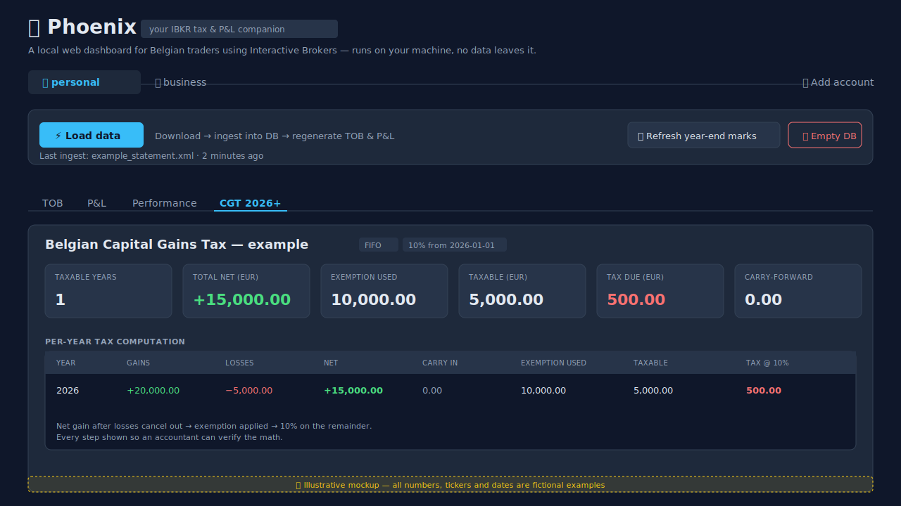
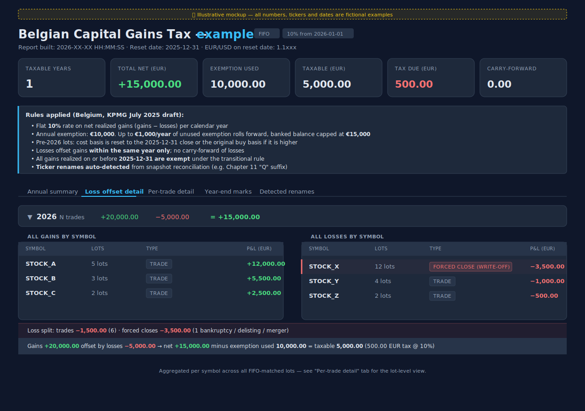
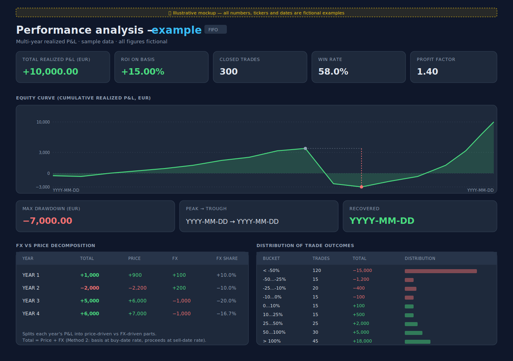
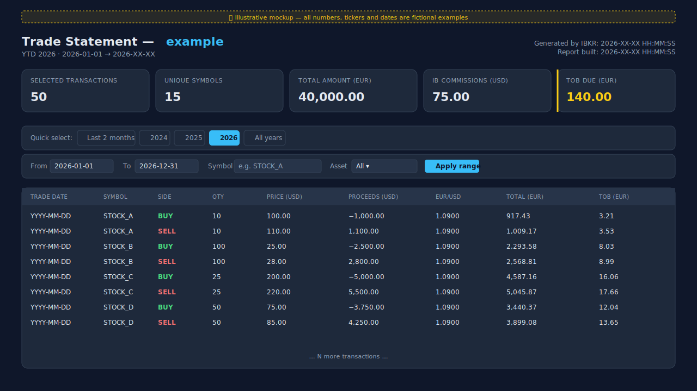
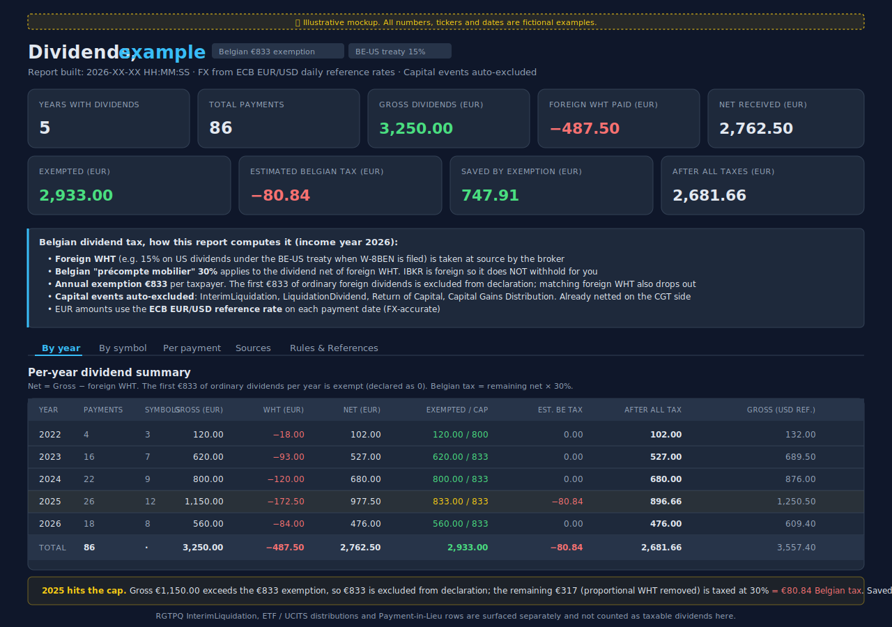

# Phoenix


**Your IBKR tax & P&L companion — built for Belgian traders.**
&nbsp;`v0.1.0-beta`

A local web dashboard that turns your Interactive Brokers statements into the tax reports your accountant actually needs: the new **Belgian capital gains tax** (10% from 2026), the existing **TOB** transaction tax (0.35%), and a multi-year **P&L analysis** that finally tells you the truth about your trading.

> 🔒 **Runs entirely on your machine.** Your trade history never leaves your computer.

> 🧪 **First public beta.** Core features (TOB, P&L, CGT 2026+, multi-account) work end-to-end and are
> output-verified. Some polish and longer-term features are still being built — see [Future work](#-future-work) below.

<br clear="all">

---

## What it does, in one minute

| Report | What it answers |
|---|---|
| 💸 **Belgian CGT 2026+** | "How much capital gains tax do I owe under the new regime — and exactly which trades drove it?" |
| 🧾 **TOB** | "What 0.35% transaction tax do I owe this period?" |
| 📊 **P&L Performance** | "Am I actually a good trader? Where did my money come from — picks or just the dollar moving?" |
| 🪙 **Per-trade detail** | "Show me lot-by-lot what my accountant will see." |
| 💰 **Dividends** | "What did I receive in dividends, what was withheld at source, and how does the Belgian €833 exemption apply?" |
| 📚 **Methodology** | "How exactly did Phoenix arrive at every figure above? Where in the code does each rule live?" |

All reports are generated from a single click on **⚡ Load data**.



> 🖱 Want a richer interactive preview? Open the live HTML mockups:
> [📋 Dashboard](docs/mockups/dashboard.html) ·
> [💸 CGT 2026+](docs/mockups/cgt-report.html) ·
> [📊 P&L Performance](docs/mockups/pnl-performance.html) ·
> [🧾 TOB](docs/mockups/tob-report.html)

---

## ✨ Key features

### 🇧🇪 Belgian Capital Gains Tax 2026+

Belgium's brand-new **10% tax on financial assets** (effective 1 January 2026) is the headline feature.
Phoenix implements every rule from the KPMG July 2025 reference text:

- **10% flat rate** on net realized gains per calendar year
- **€10,000 annual exemption**, with up to **€1,000/year** carrying forward (capped at €15,000 in the bank)
- **Cost basis reset to 31 Dec 2025** for any pre-2026 lot — *or the original buy basis if it was higher* (favorable for 5 years)
- **Same-year loss offset** — losses cancel gains 1:1 before the exemption applies
- **Transitional exemption** — everything closed by 2025-12-31 stays tax-free



> 🖱 [Open the interactive HTML version →](docs/mockups/cgt-report.html)

#### 🧬 Smart symbol-change detection

When a stock enters Chapter 11 it often gets renamed (e.g. a "Q" suffix), or merged into a successor entity.
IBKR doesn't always record this as a corporate action, which means a naive calculator would write the position
off as a bankruptcy in the wrong year — and the loss would land in an exempt period and be wasted.

Phoenix walks your IBKR snapshots and **automatically detects ticker renames** by reconciling
quantities across consecutive year-ends — accounting for trades, splits, transfers, and explicit corporate
actions in between. Detected renames roll the basis forward as a non-taxable event, so the loss lands on
the right year.

> *Fully automatic and works for any user, any tickers — no manual rules to maintain.*

Every detection is logged with a rationale, so you and your accountant can audit each one.

---

### 📊 P&L Performance analysis

A full trader scorecard with FX-accurate EUR conversion (the basis is locked at the buy-date EUR/USD rate;
proceeds at the sell-date rate — so realized P&L correctly captures FX movement during the holding period).

What you get:

- **Equity curve** — cumulative realized P&L over time, with max-drawdown peak/trough markers
- **FX vs price decomposition** — how much of each year's P&L came from picking the right stocks vs the dollar drifting
- **Distribution of trade outcomes** — bucketed by % return, with a horizontal bar visualization
- **Headline KPIs** — win rate, profit factor, avg win/loss, expectancy, ROI on basis, best/worst trade
- **Annual heatmap** — month-by-month P&L grid for spotting seasonal patterns
- **Top winners / losers by symbol** — aggregated across all FIFO-matched lots



> 🖱 [Open the interactive HTML version →](docs/mockups/pnl-performance.html)

---

### 🧾 TOB (Belgian transaction tax)

The classic 0.35% Taxe sur les Opérations de Bourse, computed automatically:

- Reads your Flex statement, applies the **ECB EUR/USD daily reference rate** to every leg
- Computes `Total_EUR = |proceeds| / rate` and `TOB = Total_EUR × 0.35%`
- Filterable by year / date range / symbol / asset class
- Exports to CSV for direct import into your tax form



> 🖱 [Open the interactive HTML version →](docs/mockups/tob-report.html)

---

### 💰 Dividends and foreign WHT

A dedicated tab summarises every dividend the broker paid you, the foreign
withholding tax taken at source, and the estimated Belgian "précompte mobilier"
you still owe on top.

- Reads from both the **Activity Statement CSV** (Dividends + Withholding Tax sections)
  and the **Flex XML** (CashTransactions section, when enabled in your Flex Query)
- Pairs each dividend with its withholding row on (date, symbol, per-share)
- FX-accurate EUR conversion using the ECB daily rate on each pay date
- Applies the **€833 annual exemption** (income years 2025 and 2026, per SPF Finances) as
  exclusion-from-declaration: the first €833 of ordinary dividends is not declared
  and the matching foreign WHT drops out of the calculation
- Auto-excludes capital events (`InterimLiquidation`, `LiquidationDividend`,
  `Return of Capital`, `Capital Gains Distribution`). They belong to the cost-basis
  / CGT side of the engine, not to dividend income
- Per-payment, per-symbol, per-year, and per-source-file breakdowns; plus a full
  Rules & References tab citing CIR 92 art. 21,5°-14° and the BE-US treaty



---

### 📚 Methodology page

A single document covering how Phoenix processes every IBKR file and how every
figure in every report is computed: ingestion, FIFO lot accounting, corporate
actions, transfers, FX, TOB, P&L, performance, CGT 2026+ basis reset, corporate
income tax, Reynders tax (30% on bond-fund interest slice), crypto rules for
personal vs corporate, dividend exemption math, and the capital-events filter.
Use it as the audit checklist when reviewing the output with your accountant.

---

### 📤 CSV export per report

Every tax report (TOB, P&L, CGT, Dividends, Corporate Tax) has a **Download CSV**
button in the topbar that emits the underlying data — one row per transaction
for the transaction reports, one row per year for the CIT roll-up. Route:
`/report/<kind>/<account>/csv`. Share links have their own scoped CSV route at
`/share/<token>/report/<kind>/csv?account=<code>` so an accountant with a
view-only link can pull the raw data without shell access. Filenames encode the
account, report kind, and generation date so multiple downloads don't collide.

---

### 🔒 Privacy by design

- **Local-only.** Everything runs on `127.0.0.1`. No cloud, no telemetry, no analytics.
- **Your data, your machine.** Trade history lives in a SQLite file beside the app.
- **Privacy toggle** — a single 👁 button blurs all numbers in the UI when you're sharing your screen.
- **Open source.** Inspect every line. The math is auditable.

---

### 🤝 Multi-account, account-agnostic

Manage multiple IBKR accounts from one dashboard:
- Add as many accounts as you have (personal, business, family members, etc.)
- Each gets its own folder, its own data, its own reports
- Tokens stored in the local DB (never in environment variables, never in logs)

---

## 🚀 Quick start

### 1. Install

```bash
git clone <this-repo>
cd Parser
python -m venv .venv
.\.venv\Scripts\Activate.ps1     # Windows PowerShell
# or:  source .venv/bin/activate  # Linux/macOS
pip install -r requirements.txt
```

Two external dependencies: `pandas` and `requests`. That's it.

### 2. Configure your IBKR Flex query (one-time)

In your IBKR Client Portal:
1. **Performance & Reports → Flex Queries** → create an Activity Flex Query (XML format, Year-to-Date, include the *Trades* section)
2. **Flex Web Service Configuration** → Enable → copy the token (shown once)
3. Note the Query ID

Run the app once, click **＋ Add account**, paste the token + query ID. Done.

### 3. Run

Two ways to run Phoenix:

**A. Docker (recommended for any non-trivial deploy)**

```bash
cp .env.runtime.example .env.runtime
# Edit .env.runtime — generate password hash + secret key per the comments.
# Remember to double every $ in the hash (Compose interpolation).

docker compose up --build
```

Open http://127.0.0.1:5000 → log in with the credentials you set in `.env.runtime`.

**B. Local Python (Windows/macOS/Linux without Docker)**

The application source now lives in `src/`. Run it from the project root with:

```bash
python src/app.py
```

Or `cd src && python app.py`. Either works.

**C. EC2 via GitHub Actions** (push-to-deploy)

See [`docs/ec2-setup.md`](docs/ec2-setup.md) for the one-time setup
(provision the box, configure GitHub Secrets, configure SSH). After that,
every push to `main` triggers `.github/workflows/deploy.yml` which:

1. rsyncs the source to EC2.
2. Renders `.env.runtime` on EC2 from your GitHub Secrets (with `$` escaping handled automatically).
3. Rebuilds the Docker image and recreates the container.
4. **Never touches** the host's `/var/phoenix-data/` directory, so your
   trade history, accounts, and dividend records survive every deploy.

Open http://127.0.0.1:5000. Click **⚡ Load data** to download your statement and ingest it.
Reports regenerate automatically.

---

## 🛣️ Future work

The `v0.1.0-beta` covers what a typical Belgian retail trader needs *today*. Items below are queued for
upcoming versions, roughly in the order they're likely to ship:

### Near-term
- 📂 **Data-sources panel** — show every loaded XML / manually-added CSV with its covered year range,
  ingest timestamp, and row counts. Lets you see at a glance which years are populated and which need
  a historical CSV drop.
- 🖼️ **Add-account mockup** — visual walk-through of the "Add account" flow (token, query ID, type)
  for first-time users.
- 🖨️ **Print extract for the accountant** — a single-page printable PDF/HTML view per report,
  formatted for hand-off (no interactive elements, A4-friendly, designed to staple to a tax filing).
- 🔧 Manual override for auto-detected renames (in case the heuristic misfires).
- ✏️ Year-end mark editor in the UI (for delisted tickers Yahoo doesn't carry).

### Medium-term
- 📅 **Dynamic CGT years** — the current calculator hard-codes `2025-12-31` (basis-reset date) and
  `2026-01-01` (regime start). When 2027/2028/etc. roll around, the report should automatically extend
  the per-year breakdown without code changes. Reset-date and exemption-bank state need to be
  parameterised by year.
- 🏢 **Business / corporate tax** — accounts marked `business` currently use the same retail CGT
  pipeline. Belgian corporate tax (ISOC) has different rules: capital gains as ordinary income at
  the corporate rate, separate deduction regime, etc. Needs a parallel report mode.
- 🇧🇪 Export to a Belgian tax-form-friendly CSV (with the field names the form expects).

### Out of scope (for now)
- The two CGT special regimes — 33 % on **internal capital gains** (sale to a controlled company) and
  the progressive 0 % / 1.25 % / 2.5 % / 5 % / 10 % scheme for **substantial shareholdings (≥20 %)**.
  These don't apply to typical retail IBKR activity; if you need them, your accountant has tools.
- Live (unrealised) P&L. Phoenix is realised-only because that's what the tax forms ask for. A live
  P&L would need a market-data feed (paid) and is intentionally out of scope.

---

## 📜 License

Phoenix is **source-available** under a non-commercial-use license.

- ✅ **Free** for personal use, code review, modification, and pull requests.
- ✅ **Free** to fork and run on your own machine to file your own taxes.
- 💼 **Commercial use** (hosting Phoenix as a paid service, embedding it in a paid
  product, or using it inside a for-profit accounting / wealth-management practice)
  requires a separate license from [Latentia](https://www.latentia.ai/).

See [`LICENSE`](LICENSE) for the full terms. To inquire about a commercial license,
contact us via [latentia.ai](https://www.latentia.ai/).

---

## ⚠️ Disclaimer

This tool implements Belgian tax law as described in the KPMG July 2025 reference text. The legislation was
not yet final when this was written. Use the output as a starting point for your tax filing — **not as legal
advice**. Always have your accountant verify the numbers before filing. The author is a trader, not a tax
attorney.

---

## 🤝 Contributing

Issues and pull requests welcome. The codebase is intentionally compact and follows a `src/` layout:

```
.
├── src/                    # All application code
│   ├── app.py              # Flask routes
│   ├── ingest.py           # ETL entry point
│   ├── ibkr_flex.py        # IBKR Flex Web Service client
│   ├── core/               # DB, loaders, FX rates, account / secrets management
│   ├── reports/            # TOB, P&L, CGT, Dividends, Methodology builders
│   ├── templates/          # Jinja templates (base + per-report)
│   └── static/             # CSS + JS
├── scripts/                # One-off tooling (migrate-to-docker.py)
├── docs/                   # Architecture notes + mockups
├── phoenix-data/           # User data dir (gitignored, mounted into Docker)
├── Dockerfile              # python:3.12-slim + gunicorn
├── docker-compose.yml      # Single-service local + EC2 deploy
├── .env.runtime.example    # Template — copy to .env.runtime and fill in
├── LICENSE                 # Source-available, non-commercial
└── requirements.txt        # Pinned deps
```

For a tour of the math (FIFO matching, FX-accurate Method 2, basis reset, exemption rollover bank,
symbol-change detection), see the docstrings in `src/reports/cgt.py` and `src/reports/pnl.py`.

---

🦅 *Built for FIRE-minded Belgian traders who want to know exactly what they owe — and exactly why.*

<sub>Built by **[Latentia](https://www.latentia.ai/)** · Free for personal, non-commercial use · [Commercial licensing on request](https://www.latentia.ai/)</sub>
